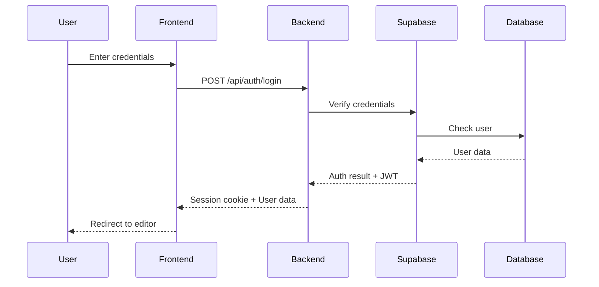
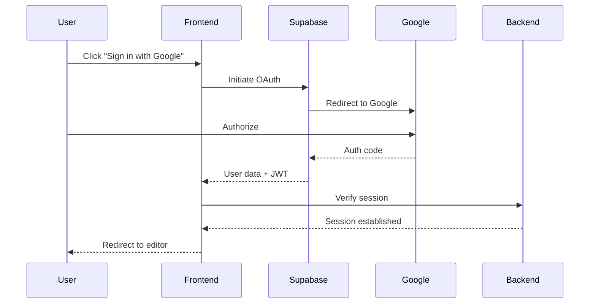

# EzEdit.co Technical Documentation Guide

## Table of Contents
1. [Architecture Overview](#architecture-overview)
2. [Frontend Implementation](#frontend-implementation)
3. [Backend Services](#backend-services)
4. [Database Schema](#database-schema)
5. [API Documentation](#api-documentation)
6. [Authentication Flow](#authentication-flow)
7. [FTP Implementation](#ftp-implementation)
8. [Monaco Editor Integration](#monaco-editor-integration)
9. [AI Assistant Integration](#ai-assistant-integration)
10. [Deployment Guide](#deployment-guide)
11. [Testing Strategy](#testing-strategy)
12. [Performance Optimization](#performance-optimization)
13. [Security Considerations](#security-considerations)
14. [Troubleshooting](#troubleshooting)

## Architecture Overview

### System Design

```
┌─────────────────┐     ┌──────────────────┐     ┌─────────────────┐
│                 │     │                  │     │                 │
│  Web Browser    │────▶│  Netlify CDN     │────▶│  Static Assets  │
│  (Client)       │     │                  │     │  (HTML/JS/CSS)  │
│                 │     │                  │     │                 │
└────────┬────────┘     └──────────────────┘     └─────────────────┘
         │
         │ HTTPS/WSS
         │
┌────────▼────────┐     ┌──────────────────┐     ┌─────────────────┐
│                 │     │                  │     │                 │
│  API Gateway    │────▶│  PHP Backend     │────▶│  FTP Servers    │
│  (Nginx)        │     │  (DigitalOcean)  │     │  (Customer)     │
│                 │     │                  │     │                 │
└────────┬────────┘     └────────┬─────────┘     └─────────────────┘
         │                       │
         │                       │
┌────────▼────────┐     ┌────────▼─────────┐     ┌─────────────────┐
│                 │     │                  │     │                 │
│  Supabase       │     │  AI Services     │     │  External APIs  │
│  (Auth/DB)      │     │  (Claude/OpenAI) │     │  (Stripe/etc)   │
│                 │     │                  │     │                 │
└─────────────────┘     └──────────────────┘     └─────────────────┘
```

### Technology Stack

#### Frontend
- **Core**: Vanilla JavaScript (ES6+)
- **Editor**: Monaco Editor v0.36.1 (CDN)
- **Styling**: Tailwind CSS v3.x
- **Icons**: Heroicons
- **Fonts**: Inter (Google Fonts)
- **State**: LocalStorage + SessionStorage

#### Backend
- **Language**: PHP 8.2+
- **Framework**: Custom MVC
- **Database**: PostgreSQL 15 (Supabase)
- **Cache**: APCu (optional)
- **Sessions**: PHP native sessions

#### Infrastructure
- **Static Hosting**: Netlify
- **API Hosting**: DigitalOcean Droplet
- **Database**: Supabase (PostgreSQL)
- **CDN**: Cloudflare
- **Monitoring**: UptimeRobot

## Frontend Implementation

### Directory Structure

```
/public/
├── index.php          # Landing page
├── editor.php         # Main editor interface
├── auth.php           # Authentication pages
├── pricing.php        # Pricing/plans page
├── css/
│   ├── styles.css     # Main styles
│   └── editor.css     # Editor-specific styles
├── js/
│   ├── app.js         # Main application logic
│   ├── auth.js        # Authentication handling
│   ├── monaco-editor.js    # Monaco integration
│   ├── file-explorer.js    # File tree component
│   ├── ftp-service.js      # FTP API client
│   ├── ai-assistant.js     # AI integration
│   └── utils.js            # Utility functions
├── ftp/
│   └── ftp-handler.php     # FTP backend service
└── assets/
    └── images/             # Static images
```

### Core Components

#### 1. Application Bootstrap (`app.js`)

```javascript
// Main application initialization
class EzEditApp {
    constructor() {
        this.editor = null;
        this.fileExplorer = null;
        this.ftpService = null;
        this.aiAssistant = null;
        this.currentFile = null;
        this.isDirty = false;
    }

    async init() {
        // Check authentication
        await this.checkAuth();
        
        // Initialize components
        this.initializeEditor();
        this.initializeFileExplorer();
        this.initializeFTPService();
        this.initializeAIAssistant();
        
        // Set up event listeners
        this.setupEventListeners();
        
        // Restore last session
        await this.restoreSession();
    }
}
```

#### 2. File Explorer Component

```javascript
// File tree implementation
class FileExplorer {
    constructor(container, ftpService) {
        this.container = container;
        this.ftpService = ftpService;
        this.currentPath = '/';
        this.expandedFolders = new Set();
    }

    async renderTree(path = '/') {
        const items = await this.ftpService.listDirectory(path);
        const tree = this.buildTreeHTML(items, path);
        this.container.innerHTML = tree;
        this.attachEventListeners();
    }

    buildTreeHTML(items, parentPath) {
        // Recursive tree building
        return items.map(item => {
            if (item.type === 'directory') {
                return this.renderFolder(item, parentPath);
            }
            return this.renderFile(item, parentPath);
        }).join('');
    }
}
```

#### 3. Monaco Editor Integration

```javascript
// Monaco editor wrapper
class MonacoEditorWrapper {
    constructor(container) {
        this.container = container;
        this.editor = null;
        this.diffEditor = null;
        this.originalContent = '';
    }

    async initialize() {
        return new Promise((resolve) => {
            require.config({
                paths: {
                    'vs': 'https://cdn.jsdelivr.net/npm/monaco-editor@0.36.1/min/vs'
                }
            });

            require(['vs/editor/editor.main'], () => {
                this.createDiffEditor();
                resolve();
            });
        });
    }

    createDiffEditor() {
        this.diffEditor = monaco.editor.createDiffEditor(this.container, {
            enableSplitViewResizing: true,
            renderSideBySide: true,
            automaticLayout: true
        });
    }
}
```

### State Management

```javascript
// Application state manager
class StateManager {
    constructor() {
        this.state = {
            user: null,
            ftpConnections: [],
            activeConnection: null,
            openFiles: [],
            activeFile: null,
            editorSettings: {
                theme: 'vs-dark',
                fontSize: 14,
                wordWrap: 'on'
            }
        };
    }

    persist() {
        localStorage.setItem('ezEditState', JSON.stringify(this.state));
    }

    restore() {
        const saved = localStorage.getItem('ezEditState');
        if (saved) {
            this.state = { ...this.state, ...JSON.parse(saved) };
        }
    }
}
```

## Backend Services

### MVC Architecture

```
/app/
├── Controllers/
│   ├── AuthController.php
│   ├── FTPController.php
│   ├── UserController.php
│   └── AIController.php
├── Models/
│   ├── User.php
│   ├── FTPConnection.php
│   └── Session.php
├── Views/
│   └── (PHP templates)
├── Core/
│   ├── Router.php
│   ├── Database.php
│   └── Controller.php
└── Config/
    └── config.php
```

### FTP Service Implementation

```php
<?php
// /public/ftp/ftp-handler.php
class FTPHandler {
    private $connections = [];
    
    public function handleRequest() {
        $action = $_GET['action'] ?? '';
        $connectionId = $_GET['connection_id'] ?? '';
        
        switch ($action) {
            case 'connect':
                return $this->connect($_POST);
            case 'list':
                return $this->listDirectory($connectionId, $_GET['path']);
            case 'get':
                return $this->getFile($connectionId, $_GET['path']);
            case 'put':
                return $this->putFile($connectionId, $_POST);
            case 'mkdir':
                return $this->createDirectory($connectionId, $_POST['path']);
            case 'delete':
                return $this->deleteItem($connectionId, $_POST['path']);
            case 'rename':
                return $this->renameItem($connectionId, $_POST);
            default:
                return $this->error('Invalid action');
        }
    }
    
    private function connect($params) {
        $conn = ftp_connect($params['host'], $params['port'] ?? 21);
        if (!$conn) {
            return $this->error('Connection failed');
        }
        
        if (!ftp_login($conn, $params['username'], $params['password'])) {
            return $this->error('Authentication failed');
        }
        
        ftp_pasv($conn, true);
        
        $connectionId = uniqid('ftp_');
        $_SESSION['ftp_connections'][$connectionId] = $conn;
        
        return $this->success(['connection_id' => $connectionId]);
    }
}
```

### Authentication Service

```php
<?php
// /app/Controllers/AuthController.php
class AuthController extends Controller {
    private $supabase;
    
    public function __construct() {
        $this->supabase = new SupabaseClient(
            $_ENV['SUPABASE_URL'],
            $_ENV['SUPABASE_ANON_KEY']
        );
    }
    
    public function login() {
        $email = $_POST['email'] ?? '';
        $password = $_POST['password'] ?? '';
        
        $result = $this->supabase->auth->signInWithPassword([
            'email' => $email,
            'password' => $password
        ]);
        
        if ($result->error) {
            return $this->error($result->error->message);
        }
        
        $_SESSION['user'] = $result->user;
        $_SESSION['access_token'] = $result->session->access_token;
        
        return $this->success(['user' => $result->user]);
    }
}
```

## Database Schema

### Users Table
```sql
CREATE TABLE users (
    id UUID PRIMARY KEY DEFAULT uuid_generate_v4(),
    email VARCHAR(255) UNIQUE NOT NULL,
    full_name VARCHAR(255),
    avatar_url TEXT,
    subscription_status VARCHAR(50) DEFAULT 'free_trial',
    subscription_ends_at TIMESTAMP,
    created_at TIMESTAMP DEFAULT CURRENT_TIMESTAMP,
    updated_at TIMESTAMP DEFAULT CURRENT_TIMESTAMP
);
```

### FTP Connections Table
```sql
CREATE TABLE ftp_connections (
    id UUID PRIMARY KEY DEFAULT uuid_generate_v4(),
    user_id UUID REFERENCES users(id) ON DELETE CASCADE,
    name VARCHAR(255) NOT NULL,
    host VARCHAR(255) NOT NULL,
    port INTEGER DEFAULT 21,
    username VARCHAR(255) NOT NULL,
    password_encrypted TEXT NOT NULL,
    protocol VARCHAR(10) DEFAULT 'ftp',
    passive_mode BOOLEAN DEFAULT true,
    created_at TIMESTAMP DEFAULT CURRENT_TIMESTAMP,
    last_used_at TIMESTAMP
);
```

### File History Table
```sql
CREATE TABLE file_history (
    id UUID PRIMARY KEY DEFAULT uuid_generate_v4(),
    user_id UUID REFERENCES users(id) ON DELETE CASCADE,
    connection_id UUID REFERENCES ftp_connections(id) ON DELETE CASCADE,
    file_path TEXT NOT NULL,
    content TEXT,
    action VARCHAR(50),
    created_at TIMESTAMP DEFAULT CURRENT_TIMESTAMP
);
```

### AI Conversations Table
```sql
CREATE TABLE ai_conversations (
    id UUID PRIMARY KEY DEFAULT uuid_generate_v4(),
    user_id UUID REFERENCES users(id) ON DELETE CASCADE,
    file_path TEXT,
    messages JSONB NOT NULL DEFAULT '[]',
    tokens_used INTEGER DEFAULT 0,
    created_at TIMESTAMP DEFAULT CURRENT_TIMESTAMP,
    updated_at TIMESTAMP DEFAULT CURRENT_TIMESTAMP
);
```

## API Documentation

### Authentication Endpoints

#### POST /api/auth/login
```http
POST /api/auth/login
Content-Type: application/json

{
    "email": "user@example.com",
    "password": "password123"
}

Response:
{
    "success": true,
    "data": {
        "user": {
            "id": "uuid",
            "email": "user@example.com",
            "subscription_status": "pro"
        },
        "token": "jwt_token"
    }
}
```

#### POST /api/auth/logout
```http
POST /api/auth/logout
Authorization: Bearer {token}

Response:
{
    "success": true,
    "message": "Logged out successfully"
}
```

### FTP Endpoints

#### POST /ftp/ftp-handler.php?action=connect
```http
POST /ftp/ftp-handler.php?action=connect
Content-Type: application/x-www-form-urlencoded

host=ftp.example.com&username=user&password=pass&port=21

Response:
{
    "success": true,
    "data": {
        "connection_id": "ftp_abc123"
    }
}
```

#### GET /ftp/ftp-handler.php?action=list
```http
GET /ftp/ftp-handler.php?action=list&connection_id=ftp_abc123&path=/public_html

Response:
{
    "success": true,
    "data": [
        {
            "name": "index.html",
            "type": "file",
            "size": 1024,
            "modified": "2024-01-15T10:30:00Z",
            "permissions": "644"
        },
        {
            "name": "css",
            "type": "directory",
            "modified": "2024-01-10T08:00:00Z",
            "permissions": "755"
        }
    ]
}
```

### AI Assistant Endpoints

#### POST /api/ai/complete
```http
POST /api/ai/complete
Authorization: Bearer {token}
Content-Type: application/json

{
    "prompt": "Explain this code",
    "context": "function add(a, b) { return a + b; }",
    "model": "claude-3-sonnet"
}

Response:
{
    "success": true,
    "data": {
        "completion": "This is a simple JavaScript function...",
        "tokens_used": 150
    }
}
```

## Authentication Flow

### Standard Email/Password Flow



### OAuth Flow (Google)



## FTP Implementation

### Connection Management

```php
class FTPConnectionPool {
    private static $instance = null;
    private $connections = [];
    private $maxConnections = 10;
    private $timeout = 300; // 5 minutes
    
    public static function getInstance() {
        if (self::$instance === null) {
            self::$instance = new self();
        }
        return self::$instance;
    }
    
    public function getConnection($connectionId) {
        if (!isset($this->connections[$connectionId])) {
            throw new Exception('Invalid connection ID');
        }
        
        $conn = $this->connections[$connectionId];
        
        // Check if connection is still alive
        if (!ftp_nlist($conn['resource'], '.')) {
            $this->reconnect($connectionId);
        }
        
        $conn['last_used'] = time();
        return $conn['resource'];
    }
    
    private function reconnect($connectionId) {
        $conn = $this->connections[$connectionId];
        $resource = ftp_connect($conn['host'], $conn['port']);
        
        if (!ftp_login($resource, $conn['username'], $conn['password'])) {
            throw new Exception('Reconnection failed');
        }
        
        ftp_pasv($resource, true);
        $this->connections[$connectionId]['resource'] = $resource;
    }
}
```

### File Operations

```php
class FTPFileOperations {
    private $pool;
    
    public function __construct() {
        $this->pool = FTPConnectionPool::getInstance();
    }
    
    public function downloadFile($connectionId, $remotePath) {
        $conn = $this->pool->getConnection($connectionId);
        $tempFile = tempnam(sys_get_temp_dir(), 'ftp_');
        
        if (!ftp_get($conn, $tempFile, $remotePath, FTP_BINARY)) {
            throw new Exception('Download failed');
        }
        
        $content = file_get_contents($tempFile);
        unlink($tempFile);
        
        return $content;
    }
    
    public function uploadFile($connectionId, $remotePath, $content) {
        $conn = $this->pool->getConnection($connectionId);
        $tempFile = tempnam(sys_get_temp_dir(), 'ftp_');
        
        file_put_contents($tempFile, $content);
        
        if (!ftp_put($conn, $remotePath, $tempFile, FTP_BINARY)) {
            unlink($tempFile);
            throw new Exception('Upload failed');
        }
        
        unlink($tempFile);
        return true;
    }
}
```

## Monaco Editor Integration

### Editor Configuration

```javascript
// Monaco editor setup
const editorConfig = {
    // Editor options
    automaticLayout: true,
    fontSize: 14,
    fontFamily: "'Fira Code', 'Consolas', monospace",
    fontLigatures: true,
    minimap: {
        enabled: true,
        scale: 1,
        showSlider: 'mouseover'
    },
    
    // Diff editor specific
    enableSplitViewResizing: true,
    renderSideBySide: true,
    renderIndicators: true,
    originalEditable: false,
    
    // IntelliSense
    quickSuggestions: {
        other: true,
        comments: false,
        strings: true
    },
    parameterHints: {
        enabled: true
    },
    suggestOnTriggerCharacters: true,
    
    // Formatting
    formatOnPaste: true,
    formatOnType: true,
    
    // Accessibility
    accessibilitySupport: 'auto',
    accessibilityPageSize: 10
};
```

### Language Support

```javascript
// Language detection and configuration
class LanguageDetector {
    static detectLanguage(filename) {
        const extension = filename.split('.').pop().toLowerCase();
        const languageMap = {
            'js': 'javascript',
            'jsx': 'javascript',
            'ts': 'typescript',
            'tsx': 'typescript',
            'py': 'python',
            'php': 'php',
            'html': 'html',
            'htm': 'html',
            'css': 'css',
            'scss': 'scss',
            'sass': 'sass',
            'less': 'less',
            'json': 'json',
            'xml': 'xml',
            'sql': 'sql',
            'md': 'markdown',
            'yml': 'yaml',
            'yaml': 'yaml'
        };
        
        return languageMap[extension] || 'plaintext';
    }
    
    static getLanguageConfig(language) {
        const configs = {
            javascript: {
                tabSize: 2,
                insertSpaces: true,
                detectIndentation: true
            },
            python: {
                tabSize: 4,
                insertSpaces: true,
                detectIndentation: false
            },
            php: {
                tabSize: 4,
                insertSpaces: true,
                detectIndentation: true
            }
        };
        
        return configs[language] || { tabSize: 4, insertSpaces: true };
    }
}
```

### Custom Actions

```javascript
// Register custom editor actions
function registerCustomActions(editor) {
    // Save file action
    editor.addAction({
        id: 'save-file',
        label: 'Save File',
        keybindings: [monaco.KeyMod.CtrlCmd | monaco.KeyCode.KEY_S],
        precondition: null,
        keybindingContext: null,
        contextMenuGroupId: 'file',
        contextMenuOrder: 1.5,
        run: async function(ed) {
            await saveCurrentFile();
            return null;
        }
    });
    
    // Format document
    editor.addAction({
        id: 'format-document',
        label: 'Format Document',
        keybindings: [
            monaco.KeyMod.Shift | monaco.KeyMod.Alt | monaco.KeyCode.KEY_F
        ],
        run: async function(ed) {
            await ed.getAction('editor.action.formatDocument').run();
            return null;
        }
    });
}
```

## AI Assistant Integration

### Klein Assistant Implementation

```javascript
class KleinAssistant {
    constructor(apiKey) {
        this.apiKey = apiKey;
        this.context = [];
        this.maxContextLength = 10;
    }
    
    async askQuestion(prompt, codeContext = null) {
        const messages = this.buildMessages(prompt, codeContext);
        
        const response = await fetch('/api/ai/complete', {
            method: 'POST',
            headers: {
                'Content-Type': 'application/json',
                'Authorization': `Bearer ${this.apiKey}`
            },
            body: JSON.stringify({
                messages,
                model: 'claude-3-sonnet',
                max_tokens: 1000
            })
        });
        
        const data = await response.json();
        this.addToContext(prompt, data.completion);
        
        return data.completion;
    }
    
    buildMessages(prompt, codeContext) {
        const messages = [...this.context];
        
        if (codeContext) {
            messages.push({
                role: 'system',
                content: `Current code context:\n\n${codeContext}`
            });
        }
        
        messages.push({
            role: 'user',
            content: prompt
        });
        
        return messages;
    }
}
```

### AI Features

```javascript
// AI-powered features
class AIFeatures {
    constructor(assistant) {
        this.assistant = assistant;
    }
    
    async explainCode(code) {
        const prompt = `Explain this code in simple terms:\n\n${code}`;
        return await this.assistant.askQuestion(prompt);
    }
    
    async suggestImprovement(code) {
        const prompt = `Suggest improvements for this code:\n\n${code}`;
        return await this.assistant.askQuestion(prompt);
    }
    
    async generateCode(description) {
        const prompt = `Generate code for: ${description}`;
        return await this.assistant.askQuestion(prompt);
    }
    
    async findBugs(code) {
        const prompt = `Find potential bugs in this code:\n\n${code}`;
        return await this.assistant.askQuestion(prompt);
    }
}
```

## Deployment Guide

### Netlify Deployment

1. **Static Files Setup**
```toml
# netlify.toml
[build]
  publish = "public"

[[redirects]]
  from = "/api/*"
  to = "https://api.ezedit.co/:splat"
  status = 200

[[redirects]]
  from = "/ftp/*"
  to = "https://api.ezedit.co/ftp/:splat"
  status = 200

[[headers]]
  for = "/*"
  [headers.values]
    X-Frame-Options = "DENY"
    X-Content-Type-Options = "nosniff"
    X-XSS-Protection = "1; mode=block"
    Referrer-Policy = "strict-origin-when-cross-origin"
```

2. **Environment Variables**
```bash
# Netlify environment variables
SUPABASE_URL=https://your-project.supabase.co
SUPABASE_ANON_KEY=your-anon-key
API_ENDPOINT=https://api.ezedit.co
```

### DigitalOcean Backend Setup

1. **Server Requirements**
- Ubuntu 22.04 LTS
- PHP 8.2 with FTP extension
- Nginx
- SSL certificate (Let's Encrypt)

2. **Nginx Configuration**
```nginx
server {
    listen 443 ssl http2;
    server_name api.ezedit.co;
    
    ssl_certificate /etc/letsencrypt/live/api.ezedit.co/fullchain.pem;
    ssl_certificate_key /etc/letsencrypt/live/api.ezedit.co/privkey.pem;
    
    root /var/www/ezedit/public;
    index index.php;
    
    # CORS headers
    add_header Access-Control-Allow-Origin "https://ezedit.co" always;
    add_header Access-Control-Allow-Methods "GET, POST, PUT, DELETE, OPTIONS" always;
    add_header Access-Control-Allow-Headers "Authorization, Content-Type" always;
    
    location / {
        try_files $uri $uri/ /index.php?$query_string;
    }
    
    location ~ \.php$ {
        fastcgi_pass unix:/var/run/php/php8.2-fpm.sock;
        fastcgi_index index.php;
        fastcgi_param SCRIPT_FILENAME $realpath_root$fastcgi_script_name;
        include fastcgi_params;
    }
}
```

3. **PHP Configuration**
```ini
; php.ini customizations
upload_max_filesize = 50M
post_max_size = 50M
max_execution_time = 300
memory_limit = 256M

; Enable FTP extension
extension=ftp
```

### Database Migration

```bash
# Run migrations via Supabase CLI
supabase db push
supabase db seed

# Or via SQL
psql $DATABASE_URL < migrations/001_initial_schema.sql
psql $DATABASE_URL < migrations/002_add_indexes.sql
```

## Testing Strategy

### Unit Tests

```php
// tests/FTPHandlerTest.php
class FTPHandlerTest extends PHPUnit\Framework\TestCase {
    private $handler;
    
    public function setUp(): void {
        $this->handler = new FTPHandler();
    }
    
    public function testConnect() {
        $result = $this->handler->connect([
            'host' => 'test.rebex.net',
            'username' => 'demo',
            'password' => 'password'
        ]);
        
        $this->assertTrue($result['success']);
        $this->assertNotEmpty($result['data']['connection_id']);
    }
    
    public function testListDirectory() {
        $connectionId = $this->getTestConnection();
        $result = $this->handler->listDirectory($connectionId, '/');
        
        $this->assertTrue($result['success']);
        $this->assertIsArray($result['data']);
    }
}
```

### Integration Tests

```javascript
// cypress/e2e/editor.cy.js
describe('Editor Integration', () => {
    beforeEach(() => {
        cy.login('test@example.com', 'password');
        cy.visit('/editor');
    });
    
    it('should connect to FTP server', () => {
        cy.get('[data-cy=ftp-connect]').click();
        cy.get('[data-cy=ftp-host]').type('test.rebex.net');
        cy.get('[data-cy=ftp-username]').type('demo');
        cy.get('[data-cy=ftp-password]').type('password');
        cy.get('[data-cy=connect-button]').click();
        
        cy.get('[data-cy=file-explorer]').should('contain', 'readme.txt');
    });
    
    it('should open and edit file', () => {
        cy.connectToFTP();
        cy.get('[data-cy=file-readme]').dblclick();
        cy.get('.monaco-editor').should('be.visible');
        cy.get('.modified-editor').type('// New comment');
        cy.get('[data-cy=save-file]').click();
        
        cy.get('[data-cy=success-toast]').should('contain', 'File saved');
    });
});
```

### Performance Tests

```javascript
// performance/load-test.js
import http from 'k6/http';
import { check } from 'k6';

export const options = {
    stages: [
        { duration: '30s', target: 100 },
        { duration: '1m', target: 100 },
        { duration: '30s', target: 0 },
    ],
};

export default function () {
    const res = http.get('https://ezedit.co');
    check(res, {
        'status is 200': (r) => r.status === 200,
        'page load < 3s': (r) => r.timings.duration < 3000,
    });
}
```

## Performance Optimization

### Frontend Optimization

1. **Code Splitting**
```javascript
// Lazy load Monaco Editor
const loadMonaco = () => {
    return import(
        /* webpackChunkName: "monaco" */
        './monaco-loader'
    );
};

// Load only when needed
document.getElementById('editor').addEventListener('click', async () => {
    const monaco = await loadMonaco();
    monaco.init();
});
```

2. **Asset Optimization**
```javascript
// Service worker for caching
self.addEventListener('install', (event) => {
    event.waitUntil(
        caches.open('v1').then((cache) => {
            return cache.addAll([
                '/',
                '/css/styles.css',
                '/js/app.js',
                '/assets/logo.png'
            ]);
        })
    );
});
```

3. **Virtual Scrolling**
```javascript
// File explorer virtual scrolling
class VirtualFileList {
    constructor(container, items, itemHeight = 24) {
        this.container = container;
        this.items = items;
        this.itemHeight = itemHeight;
        this.visibleItems = Math.ceil(container.clientHeight / itemHeight);
    }
    
    render(scrollTop) {
        const startIndex = Math.floor(scrollTop / this.itemHeight);
        const endIndex = startIndex + this.visibleItems;
        const visibleItems = this.items.slice(startIndex, endIndex);
        
        // Render only visible items
        this.container.innerHTML = visibleItems
            .map((item, i) => this.renderItem(item, startIndex + i))
            .join('');
    }
}
```

### Backend Optimization

1. **Connection Pooling**
```php
// FTP connection pooling
class ConnectionPool {
    private $connections = [];
    private $maxAge = 300; // 5 minutes
    
    public function getConnection($params) {
        $key = md5(serialize($params));
        
        if (isset($this->connections[$key])) {
            $conn = $this->connections[$key];
            if (time() - $conn['created'] < $this->maxAge) {
                return $conn['resource'];
            }
        }
        
        // Create new connection
        $resource = $this->createConnection($params);
        $this->connections[$key] = [
            'resource' => $resource,
            'created' => time()
        ];
        
        return $resource;
    }
}
```

2. **Caching Strategy**
```php
// File content caching
class FileCache {
    private $cache;
    private $ttl = 60; // 1 minute
    
    public function __construct() {
        $this->cache = new APCuCache();
    }
    
    public function get($connectionId, $path) {
        $key = $this->getKey($connectionId, $path);
        return $this->cache->get($key);
    }
    
    public function set($connectionId, $path, $content) {
        $key = $this->getKey($connectionId, $path);
        $this->cache->set($key, $content, $this->ttl);
    }
    
    private function getKey($connectionId, $path) {
        return "file:{$connectionId}:{$path}";
    }
}
```

## Security Considerations

### Input Validation

```php
// Validate FTP credentials
class FTPValidator {
    public static function validateHost($host) {
        // Remove protocol if present
        $host = preg_replace('#^[a-z]+://#i', '', $host);
        
        // Validate hostname or IP
        if (!filter_var($host, FILTER_VALIDATE_DOMAIN, FILTER_FLAG_HOSTNAME) &&
            !filter_var($host, FILTER_VALIDATE_IP)) {
            throw new InvalidArgumentException('Invalid host');
        }
        
        return $host;
    }
    
    public static function validatePath($path) {
        // Prevent directory traversal
        $path = str_replace(['../', '..\\'], '', $path);
        
        // Ensure path starts with /
        if (strpos($path, '/') !== 0) {
            $path = '/' . $path;
        }
        
        return $path;
    }
}
```

### Credential Encryption

```php
// Encrypt FTP passwords
class CredentialEncryption {
    private $key;
    
    public function __construct() {
        $this->key = base64_decode($_ENV['ENCRYPTION_KEY']);
    }
    
    public function encrypt($password) {
        $iv = random_bytes(16);
        $encrypted = openssl_encrypt(
            $password,
            'AES-256-CBC',
            $this->key,
            0,
            $iv
        );
        
        return base64_encode($iv . $encrypted);
    }
    
    public function decrypt($encrypted) {
        $data = base64_decode($encrypted);
        $iv = substr($data, 0, 16);
        $encrypted = substr($data, 16);
        
        return openssl_decrypt(
            $encrypted,
            'AES-256-CBC',
            $this->key,
            0,
            $iv
        );
    }
}
```

### Session Security

```php
// Secure session configuration
ini_set('session.cookie_httponly', 1);
ini_set('session.cookie_secure', 1);
ini_set('session.cookie_samesite', 'Strict');
ini_set('session.use_only_cookies', 1);
ini_set('session.use_strict_mode', 1);

session_start([
    'cookie_lifetime' => 3600, // 1 hour
    'gc_maxlifetime' => 3600,
    'use_strict_mode' => true,
    'cookie_httponly' => true,
    'cookie_secure' => true,
    'cookie_samesite' => 'Strict'
]);
```

## Troubleshooting

### Common Issues

#### 1. FTP Connection Failures
```php
// Debug FTP connections
if (!$conn = ftp_connect($host, $port, 30)) {
    error_log("FTP Connect failed: $host:$port");
    
    // Check if host is reachable
    $fp = @fsockopen($host, $port, $errno, $errstr, 5);
    if (!$fp) {
        throw new Exception("Host unreachable: $errstr ($errno)");
    }
    fclose($fp);
    
    throw new Exception("FTP service not responding");
}
```

#### 2. Monaco Editor Loading Issues
```javascript
// Fallback for Monaco CDN failures
window.MonacoEnvironment = {
    getWorkerUrl: function(moduleId, label) {
        if (label === 'json') {
            return '/fallback/json.worker.js';
        }
        if (label === 'css' || label === 'scss' || label === 'less') {
            return '/fallback/css.worker.js';
        }
        if (label === 'html' || label === 'handlebars' || label === 'razor') {
            return '/fallback/html.worker.js';
        }
        if (label === 'typescript' || label === 'javascript') {
            return '/fallback/ts.worker.js';
        }
        return '/fallback/editor.worker.js';
    }
};
```

#### 3. Session Timeout Handling
```javascript
// Auto-refresh session
class SessionManager {
    constructor() {
        this.refreshInterval = 15 * 60 * 1000; // 15 minutes
        this.startRefreshTimer();
    }
    
    startRefreshTimer() {
        setInterval(async () => {
            try {
                await fetch('/api/auth/refresh', {
                    method: 'POST',
                    credentials: 'include'
                });
            } catch (error) {
                console.error('Session refresh failed:', error);
                this.handleSessionExpired();
            }
        }, this.refreshInterval);
    }
    
    handleSessionExpired() {
        // Save current state
        const state = StateManager.getCurrentState();
        localStorage.setItem('pendingState', JSON.stringify(state));
        
        // Redirect to login
        window.location.href = '/auth/login?return_to=editor';
    }
}
```

### Debug Mode

```javascript
// Enable debug mode
if (window.location.search.includes('debug=true')) {
    window.DEBUG = true;
    
    // Log all API calls
    const originalFetch = window.fetch;
    window.fetch = async (...args) => {
        console.log('API Call:', ...args);
        const response = await originalFetch(...args);
        console.log('API Response:', response);
        return response;
    };
    
    // Log all FTP operations
    window.ftpService = new Proxy(window.ftpService, {
        get(target, prop) {
            return function(...args) {
                console.log(`FTP.${prop}:`, ...args);
                const result = target[prop](...args);
                console.log(`FTP.${prop} result:`, result);
                return result;
            };
        }
    });
}
```

### Health Checks

```php
// /api/health endpoint
class HealthController {
    public function check() {
        $checks = [
            'database' => $this->checkDatabase(),
            'ftp' => $this->checkFTPExtension(),
            'sessions' => $this->checkSessions(),
            'disk' => $this->checkDiskSpace(),
            'memory' => $this->checkMemory()
        ];
        
        $healthy = !in_array(false, $checks);
        
        return [
            'status' => $healthy ? 'healthy' : 'unhealthy',
            'checks' => $checks,
            'timestamp' => time()
        ];
    }
    
    private function checkDatabase() {
        try {
            $db = Database::getInstance();
            $db->query('SELECT 1');
            return true;
        } catch (Exception $e) {
            return false;
        }
    }
    
    private function checkFTPExtension() {
        return function_exists('ftp_connect');
    }
}
```

## Conclusion

This technical documentation provides a comprehensive guide to the EzEdit.co platform architecture, implementation details, and best practices. Regular updates to this documentation should be made as the platform evolves and new features are added.

For additional support or questions, please refer to the project's GitHub repository or contact the development team.