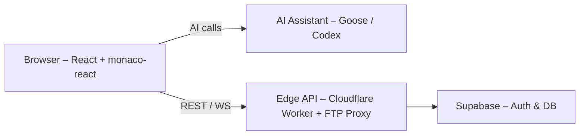

# System Architecture

| Layer  | Tech                             | Rationale                                         |
|--------|----------------------------------|---------------------------------------------------|
| UI     | React + Tailwind + monaco-react  | VS Code-like editing in browser                   |
| AI     | Goose (Claude) + OpenAI Codex    | Hybrid reasoning & code generation                |
| BFF    | Cloudflare Workers               | Serverless edge latency, scalable proxy           |
| Storage| Supabase                         | Built-in auth, RLS, S3-compatible storage         |
| FTP    | ssh2-sftp-client                 | Secure SFTP fallback for legacy TLS               |
