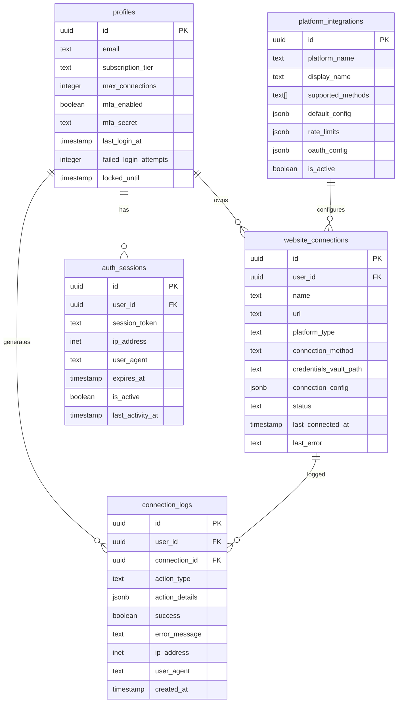

# Data Model: Authentication & Website Connection System

## Database Schema Extensions

The authentication and website connection system extends the existing Supabase schema with new tables while leveraging existing infrastructure.

## Core Entities

### User Accounts (Extends existing `profiles` table)
```sql
-- Extends existing profiles table with additional fields
ALTER TABLE profiles ADD COLUMN IF NOT EXISTS subscription_tier TEXT DEFAULT 'free' CHECK (subscription_tier IN ('free', 'pro', 'enterprise'));
ALTER TABLE profiles ADD COLUMN IF NOT EXISTS max_connections INTEGER DEFAULT 5;
ALTER TABLE profiles ADD COLUMN IF NOT EXISTS mfa_enabled BOOLEAN DEFAULT false;
ALTER TABLE profiles ADD COLUMN IF NOT EXISTS mfa_secret TEXT;
ALTER TABLE profiles ADD COLUMN IF NOT EXISTS last_login_at TIMESTAMP WITH TIME ZONE;
ALTER TABLE profiles ADD COLUMN IF NOT EXISTS failed_login_attempts INTEGER DEFAULT 0;
ALTER TABLE profiles ADD COLUMN IF NOT EXISTS locked_until TIMESTAMP WITH TIME ZONE;
```

**Key Attributes**:
- `id`: UUID (primary key, existing)
- `email`: Text (unique, existing)
- `subscription_tier`: Enum ('free', 'pro', 'enterprise')
- `max_connections`: Integer (tier-based limits)
- `mfa_enabled`: Boolean (TOTP support)
- `mfa_secret`: Text (encrypted TOTP secret)
- `last_login_at`: Timestamp (session tracking)
- `failed_login_attempts`: Integer (security lockout)
- `locked_until`: Timestamp (temporary account locks)

**Validation Rules**:
- Email must be valid format and verified
- Subscription tier determines max_connections limit
- MFA secret must be encrypted when stored
- Failed login attempts reset on successful login
- Account locks expire automatically after timeout period

### Website Connections
```sql
CREATE TABLE website_connections (
    id UUID DEFAULT gen_random_uuid() PRIMARY KEY,
    user_id UUID NOT NULL REFERENCES profiles(id) ON DELETE CASCADE,
    name TEXT NOT NULL,
    url TEXT NOT NULL,
    platform_type TEXT NOT NULL CHECK (platform_type IN ('wordpress', 'wix', 'shopify', 'ftp', 'sftp', 'custom')),
    connection_method TEXT NOT NULL CHECK (connection_method IN ('rest_api', 'sftp', 'ftp', 'oauth', 'api_key')),
    credentials_vault_path TEXT NOT NULL, -- Path to encrypted credentials in vault
    connection_config JSONB DEFAULT '{}', -- Platform-specific configuration
    status TEXT DEFAULT 'inactive' CHECK (status IN ('active', 'inactive', 'error', 'connecting')),
    last_connected_at TIMESTAMP WITH TIME ZONE,
    last_error TEXT,
    created_at TIMESTAMP WITH TIME ZONE DEFAULT now(),
    updated_at TIMESTAMP WITH TIME ZONE DEFAULT now(),
    UNIQUE(user_id, name)
);

-- RLS Policies
ALTER TABLE website_connections ENABLE ROW LEVEL SECURITY;
CREATE POLICY "Users can only access their own connections" ON website_connections
    FOR ALL USING (auth.uid() = user_id);

-- Indexes
CREATE INDEX idx_website_connections_user_id ON website_connections(user_id);
CREATE INDEX idx_website_connections_platform_type ON website_connections(platform_type);
CREATE INDEX idx_website_connections_status ON website_connections(status);
```

**Key Attributes**:
- `id`: UUID (primary key)
- `user_id`: UUID (foreign key to profiles)
- `name`: Text (user-defined connection name)
- `url`: Text (website URL)
- `platform_type`: Enum (detected or specified platform)
- `connection_method`: Enum (how to connect)
- `credentials_vault_path`: Text (secure credential reference)
- `connection_config`: JSONB (platform-specific settings)
- `status`: Enum (connection health status)
- `last_connected_at`: Timestamp (connection monitoring)
- `last_error`: Text (debugging information)

**Validation Rules**:
- User cannot exceed max_connections limit
- URL must be valid format
- Credentials must be stored in vault, never in database
- Connection config validated against platform requirements
- Status updates tracked with timestamps

### Platform Integrations
```sql
CREATE TABLE platform_integrations (
    id UUID DEFAULT gen_random_uuid() PRIMARY KEY,
    platform_name TEXT NOT NULL UNIQUE,
    display_name TEXT NOT NULL,
    supported_methods TEXT[] NOT NULL, -- Array of connection methods
    default_config JSONB DEFAULT '{}', -- Default configuration template
    rate_limits JSONB DEFAULT '{}', -- Rate limiting configuration
    oauth_config JSONB DEFAULT '{}', -- OAuth configuration if applicable
    is_active BOOLEAN DEFAULT true,
    created_at TIMESTAMP WITH TIME ZONE DEFAULT now(),
    updated_at TIMESTAMP WITH TIME ZONE DEFAULT now()
);

-- Insert default platform configurations
INSERT INTO platform_integrations (platform_name, display_name, supported_methods, rate_limits) VALUES
('wordpress', 'WordPress', ARRAY['rest_api', 'sftp'], '{"requests_per_minute": 60, "burst_allowance": 20}'),
('wix', 'Wix', ARRAY['oauth', 'api_key'], '{"requests_per_minute": 200, "burst_allowance": 50}'),
('shopify', 'Shopify', ARRAY['oauth'], '{"points_per_second": 100, "burst_allowance": 200}'),
('ftp', 'FTP Server', ARRAY['ftp'], '{"connections_per_user": 5}'),
('sftp', 'SFTP Server', ARRAY['sftp'], '{"connections_per_user": 10}');
```

**Key Attributes**:
- `id`: UUID (primary key)
- `platform_name`: Text (unique identifier)
- `display_name`: Text (user-facing name)
- `supported_methods`: Array (available connection methods)
- `default_config`: JSONB (configuration template)
- `rate_limits`: JSONB (platform-specific limits)
- `oauth_config`: JSONB (OAuth settings if applicable)
- `is_active`: Boolean (platform availability)

### Authentication Sessions (Extends existing session management)
```sql
CREATE TABLE auth_sessions (
    id UUID DEFAULT gen_random_uuid() PRIMARY KEY,
    user_id UUID NOT NULL REFERENCES profiles(id) ON DELETE CASCADE,
    session_token TEXT NOT NULL UNIQUE,
    ip_address INET,
    user_agent TEXT,
    created_at TIMESTAMP WITH TIME ZONE DEFAULT now(),
    expires_at TIMESTAMP WITH TIME ZONE DEFAULT (now() + interval '24 hours'),
    is_active BOOLEAN DEFAULT true,
    last_activity_at TIMESTAMP WITH TIME ZONE DEFAULT now()
);

-- RLS Policies
ALTER TABLE auth_sessions ENABLE ROW LEVEL SECURITY;
CREATE POLICY "Users can only access their own sessions" ON auth_sessions
    FOR ALL USING (auth.uid() = user_id);

-- Indexes
CREATE INDEX idx_auth_sessions_user_id ON auth_sessions(user_id);
CREATE INDEX idx_auth_sessions_token ON auth_sessions(session_token);
CREATE INDEX idx_auth_sessions_expires_at ON auth_sessions(expires_at);
```

**Key Attributes**:
- `id`: UUID (primary key)
- `user_id`: UUID (foreign key to profiles)
- `session_token`: Text (unique session identifier)
- `ip_address`: INET (security tracking)
- `user_agent`: Text (device identification)
- `expires_at`: Timestamp (session timeout)
- `is_active`: Boolean (session validity)
- `last_activity_at`: Timestamp (activity tracking)

**Validation Rules**:
- Session tokens must be cryptographically secure
- Sessions expire after 24 hours of inactivity
- IP address and user agent logged for security
- Multiple sessions allowed per user

### Connection Logs (Audit Trail)
```sql
CREATE TABLE connection_logs (
    id UUID DEFAULT gen_random_uuid() PRIMARY KEY,
    user_id UUID NOT NULL REFERENCES profiles(id) ON DELETE CASCADE,
    connection_id UUID REFERENCES website_connections(id) ON DELETE CASCADE,
    action_type TEXT NOT NULL CHECK (action_type IN ('connect', 'disconnect', 'file_list', 'file_upload', 'file_download', 'auth_attempt', 'error')),
    action_details JSONB DEFAULT '{}',
    success BOOLEAN NOT NULL,
    error_message TEXT,
    ip_address INET,
    user_agent TEXT,
    created_at TIMESTAMP WITH TIME ZONE DEFAULT now()
);

-- RLS Policies
ALTER TABLE connection_logs ENABLE ROW LEVEL SECURITY;
CREATE POLICY "Users can only access their own connection logs" ON connection_logs
    FOR SELECT USING (auth.uid() = user_id);

-- Indexes
CREATE INDEX idx_connection_logs_user_id ON connection_logs(user_id);
CREATE INDEX idx_connection_logs_connection_id ON connection_logs(connection_id);
CREATE INDEX idx_connection_logs_created_at ON connection_logs(created_at);
CREATE INDEX idx_connection_logs_action_type ON connection_logs(action_type);

-- Auto-cleanup old logs (90 days retention)
CREATE OR REPLACE FUNCTION cleanup_old_connection_logs()
RETURNS void AS $$
BEGIN
    DELETE FROM connection_logs WHERE created_at < now() - interval '90 days';
END;
$$ LANGUAGE plpgsql;

-- Schedule cleanup function (requires pg_cron extension)
SELECT cron.schedule('cleanup-connection-logs', '0 2 * * *', 'SELECT cleanup_old_connection_logs();');
```

**Key Attributes**:
- `id`: UUID (primary key)
- `user_id`: UUID (foreign key to profiles)
- `connection_id`: UUID (foreign key to website_connections)
- `action_type`: Enum (type of action performed)
- `action_details`: JSONB (action-specific data)
- `success`: Boolean (operation result)
- `error_message`: Text (error details if applicable)
- `ip_address`: INET (security tracking)
- `user_agent`: Text (device identification)
- `created_at`: Timestamp (audit timestamp)

**Validation Rules**:
- All actions must be logged with success/failure status
- Error messages provided for failed actions
- Logs automatically cleaned up after 90 days
- IP address and user agent captured for security

## Entity Relationships



## State Transitions

### Connection Status States
1. **inactive** → **connecting** (user initiates connection)
2. **connecting** → **active** (connection established successfully)
3. **connecting** → **error** (connection failed)
4. **active** → **error** (connection lost or failed)
5. **error** → **connecting** (user retries connection)
6. **active** → **inactive** (user disconnects)

### User Account States
1. **active** → **locked** (failed login attempts exceeded)
2. **locked** → **active** (lockout period expires or admin unlock)
3. **active** → **suspended** (admin action or policy violation)

## Security Considerations

### Credential Management
- **Never store credentials in database** - use vault paths only
- **Encrypt vault paths** using application-level encryption
- **Rotate credentials** automatically where possible
- **Audit credential access** through connection logs

### Access Control
- **Row Level Security** enabled on all tables
- **User isolation** enforced through RLS policies
- **Session validation** required for all operations
- **Rate limiting** enforced at application and database levels

### Data Protection
- **Personal data encryption** for sensitive fields
- **Audit logging** for all data access and modifications
- **Data retention policies** automatically enforced
- **GDPR compliance** through data portability and deletion rights