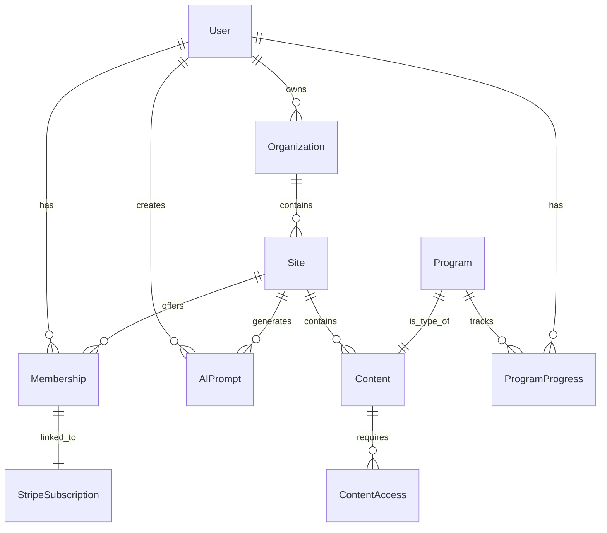

# Data Model: EzEdit Technology Engine

**Version**: 1.0.0
**Date**: 2025-09-15

## Entity Relationship Diagram

## Core Entities

### User
**Purpose**: Represents authenticated users of the system

| Field | Type | Constraints | Description |
|-------|------|-------------|-------------|
| id | UUID | PK, NOT NULL | Unique identifier (matches auth.users) |
| email | string | UNIQUE, NOT NULL | User email address |
| full_name | string | NULL | User's display name |
| avatar_url | string | NULL | Profile picture URL |
| role | enum | NOT NULL | system_admin, owner, member |
| created_at | timestamp | NOT NULL | Account creation timestamp |
| updated_at | timestamp | NOT NULL | Last modification timestamp |

**State Transitions**: None (static entity)

### Organization
**Purpose**: Represents a company/team with subscription tier

| Field | Type | Constraints | Description |
|-------|------|-------------|-------------|
| id | UUID | PK, NOT NULL | Unique identifier |
| name | string | NOT NULL | Organization name |
| owner_id | UUID | FK(User), NOT NULL | Organization owner |
| subscription_tier | enum | NOT NULL | free, starter, pro, enterprise |
| settings | JSONB | NOT NULL | Organization configuration |
| stripe_customer_id | string | NULL | Stripe customer reference |
| created_at | timestamp | NOT NULL | Creation timestamp |
| updated_at | timestamp | NOT NULL | Last modification timestamp |

**State Transitions**:
- free → starter/pro/enterprise (upgrade)
- starter/pro/enterprise → free (downgrade)
- any → suspended (payment failure)
- suspended → previous_tier (payment resolved)

### Site
**Purpose**: Represents a generated website/platform

| Field | Type | Constraints | Description |
|-------|------|-------------|-------------|
| id | UUID | PK, NOT NULL | Unique identifier |
| org_id | UUID | FK(Organization), NOT NULL | Parent organization |
| domain | string | NULL | Custom domain |
| subdomain | string | UNIQUE, NOT NULL | EzEdit subdomain |
| title | string | NOT NULL | Site title |
| description | text | NULL | Site description |
| config | JSONB | NOT NULL | Site configuration and theme |
| status | enum | NOT NULL | draft, published, archived |
| site_type | enum | NOT NULL | benchonly, fitweb, custom |
| created_at | timestamp | NOT NULL | Creation timestamp |
| updated_at | timestamp | NOT NULL | Last modification timestamp |
| published_at | timestamp | NULL | Publication timestamp |

**State Transitions**:
- draft → published (launch site)
- published → draft (unpublish)
- published/draft → archived (soft delete)
- archived → draft (restore)

### Membership
**Purpose**: Represents user subscriptions to sites

| Field | Type | Constraints | Description |
|-------|------|-------------|-------------|
| id | UUID | PK, NOT NULL | Unique identifier |
| user_id | UUID | FK(User), NOT NULL | Member user |
| site_id | UUID | FK(Site), NOT NULL | Target site |
| tier | string | NOT NULL | Membership tier name |
| status | enum | NOT NULL | active, cancelled, expired, paused |
| stripe_subscription_id | string | NULL | Stripe subscription reference |
| expires_at | timestamp | NULL | Expiration date |
| created_at | timestamp | NOT NULL | Subscription start |
| updated_at | timestamp | NOT NULL | Last modification |

**State Transitions**:
- pending → active (payment confirmed)
- active → cancelled (user cancellation)
- active → expired (time expiration)
- active → paused (user request)
- paused → active (resume)
- cancelled/expired → active (resubscribe)

### Content
**Purpose**: Represents pages, posts, programs, and media

| Field | Type | Constraints | Description |
|-------|------|-------------|-------------|
| id | UUID | PK, NOT NULL | Unique identifier |
| site_id | UUID | FK(Site), NOT NULL | Parent site |
| type | enum | NOT NULL | page, post, program, media |
| title | string | NOT NULL | Content title |
| slug | string | NOT NULL | URL slug |
| data | JSONB | NOT NULL | Content data (HTML, components) |
| access_level | string | NOT NULL | public, member, tier_name |
| published | boolean | NOT NULL | Publication status |
| order_index | integer | NULL | Display order |
| parent_id | UUID | FK(Content), NULL | Parent content (for hierarchy) |
| created_at | timestamp | NOT NULL | Creation timestamp |
| updated_at | timestamp | NOT NULL | Last modification |

**Unique Constraint**: (site_id, slug)

### Program
**Purpose**: Structured content with progress tracking (extends Content)

| Field | Type | Constraints | Description |
|-------|------|-------------|-------------|
| id | UUID | PK, FK(Content) | Content reference |
| duration_weeks | integer | NULL | Program duration |
| difficulty | enum | NULL | beginner, intermediate, advanced |
| category | string | NOT NULL | Program category |
| modules | JSONB | NOT NULL | Program structure |
| completion_criteria | JSONB | NOT NULL | Completion requirements |

### ProgramProgress
**Purpose**: Tracks user progress through programs

| Field | Type | Constraints | Description |
|-------|------|-------------|-------------|
| id | UUID | PK, NOT NULL | Unique identifier |
| user_id | UUID | FK(User), NOT NULL | User reference |
| program_id | UUID | FK(Program), NOT NULL | Program reference |
| status | enum | NOT NULL | not_started, in_progress, completed |
| progress_data | JSONB | NOT NULL | Detailed progress |
| completion_percentage | integer | NOT NULL | 0-100 percentage |
| started_at | timestamp | NULL | Start timestamp |
| completed_at | timestamp | NULL | Completion timestamp |
| updated_at | timestamp | NOT NULL | Last update |

**Unique Constraint**: (user_id, program_id)

### AIPrompt
**Purpose**: Tracks AI generation requests and results

| Field | Type | Constraints | Description |
|-------|------|-------------|-------------|
| id | UUID | PK, NOT NULL | Unique identifier |
| user_id | UUID | FK(User), NOT NULL | Requesting user |
| site_id | UUID | FK(Site), NULL | Associated site |
| prompt | text | NOT NULL | User input prompt |
| prompt_type | enum | NOT NULL | site_generation, content_creation, design_update |
| model_used | string | NOT NULL | AI model identifier |
| result | JSONB | NULL | Generation result |
| tokens_used | integer | NULL | Token consumption |
| status | enum | NOT NULL | pending, processing, completed, failed |
| error_message | text | NULL | Error details if failed |
| created_at | timestamp | NOT NULL | Request timestamp |
| completed_at | timestamp | NULL | Completion timestamp |

## Supporting Entities

### StripeSubscription
**Purpose**: Cached Stripe subscription data

| Field | Type | Constraints | Description |
|-------|------|-------------|-------------|
| id | string | PK, NOT NULL | Stripe subscription ID |
| membership_id | UUID | FK(Membership), NOT NULL | Local membership |
| customer_id | string | NOT NULL | Stripe customer ID |
| price_id | string | NOT NULL | Stripe price ID |
| status | string | NOT NULL | Stripe status |
| current_period_end | timestamp | NOT NULL | Billing period end |
| cancel_at | timestamp | NULL | Scheduled cancellation |
| metadata | JSONB | NOT NULL | Stripe metadata |
| updated_at | timestamp | NOT NULL | Last sync timestamp |

### AuditLog
**Purpose**: Track all system changes for compliance

| Field | Type | Constraints | Description |
|-------|------|-------------|-------------|
| id | UUID | PK, NOT NULL | Unique identifier |
| user_id | UUID | FK(User), NULL | Acting user |
| action | string | NOT NULL | Action performed |
| entity_type | string | NOT NULL | Entity affected |
| entity_id | UUID | NOT NULL | Entity identifier |
| changes | JSONB | NOT NULL | Change details |
| ip_address | string | NULL | Request IP |
| user_agent | string | NULL | Browser/client info |
| created_at | timestamp | NOT NULL | Action timestamp |

## Validation Rules

### User
- Email must be valid format (RFC 5322)
- Full name max 100 characters
- Avatar URL must be valid URL or null

### Organization
- Name required, max 100 characters
- Owner must exist in users table
- Settings must be valid JSON

### Site
- Subdomain must be alphanumeric with hyphens, 3-63 characters
- Domain must be valid domain format or null
- Config must contain required theme properties

### Membership
- User and site must exist
- Tier must match site's available tiers
- Stripe subscription ID required for paid tiers

### Content
- Slug must be URL-safe, unique per site
- Title required, max 200 characters
- Access level must match site's defined levels

### AIPrompt
- Prompt required, max 10000 characters
- Model must be from approved list
- Token limit enforced per request

## Indexes

### Performance Indexes
- users(email) - User lookup
- organizations(owner_id) - Owner's orgs
- sites(org_id) - Org's sites
- sites(subdomain) - Subdomain routing
- memberships(user_id, site_id) - Access checks
- content(site_id, slug) - Content routing
- content(site_id, type, published) - Content queries
- ai_prompts(user_id, created_at) - User history
- audit_log(entity_type, entity_id) - Entity history

### Composite Indexes
- memberships(site_id, status) - Active members
- content(site_id, access_level, published) - Access queries
- program_progress(user_id, status) - User progress

## Security Considerations

### Row Level Security (RLS)
- Users can only view/edit own profile
- Organization owners have full control
- Site content respects membership tiers
- Audit logs are append-only

### Data Encryption
- Passwords hashed with bcrypt (via Supabase Auth)
- Stripe tokens never stored
- Sensitive settings encrypted at rest

### GDPR Compliance
- User data exportable via API
- Right to deletion (soft delete with purge)
- Audit trail for data access
- Consent tracking in user profile