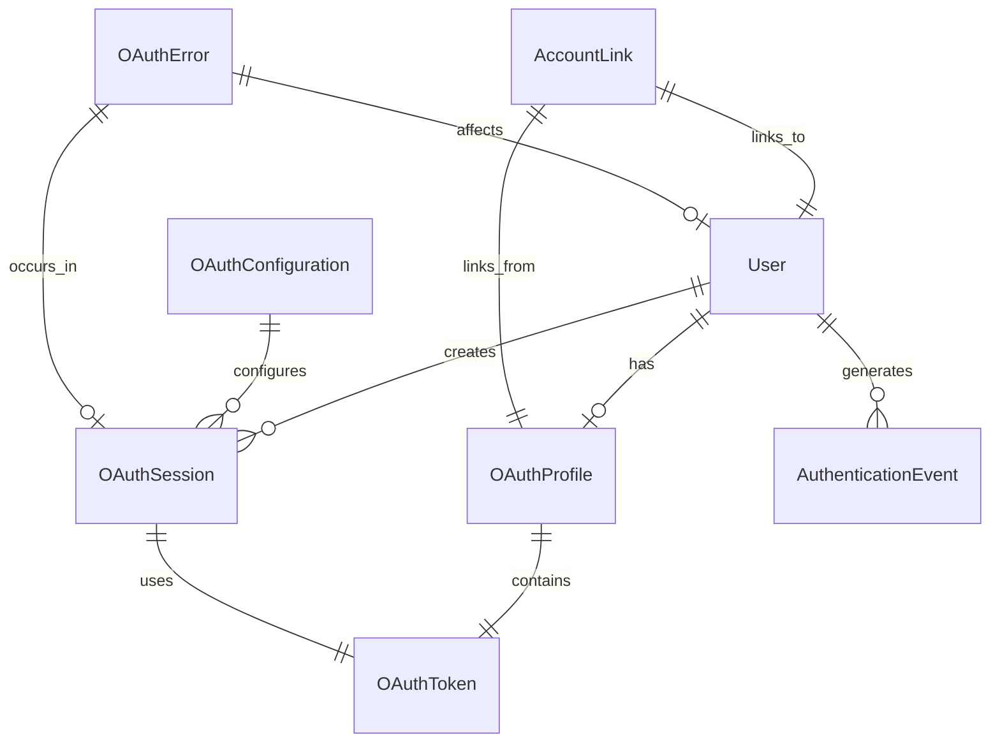

# Data Model: Google OAuth Integration

**Version**: 1.0.0
**Date**: 2025-09-15

## Entity Relationship Diagram

## Core Entities

### User (Enhanced)
**Purpose**: Existing user entity extended with OAuth capabilities

| Field | Type | Constraints | Description |
|-------|------|-------------|-------------|
| id | UUID | PK, NOT NULL | Unique identifier (existing) |
| email | string | UNIQUE, NOT NULL | User email address (existing) |
| full_name | string | NULL | User's display name (existing) |
| avatar_url | string | NULL | Profile picture URL (existing) |
| google_id | string | UNIQUE, NULL | Google OAuth user ID |
| email_verified | boolean | DEFAULT false | Email verification status |
| preferred_auth_method | enum | DEFAULT 'email' | email, google, either |
| oauth_enabled | boolean | DEFAULT false | OAuth authentication enabled |
| created_at | timestamp | NOT NULL | Account creation timestamp (existing) |
| updated_at | timestamp | NOT NULL | Last modification timestamp (existing) |

**State Transitions**: None (enhanced existing entity)

### OAuthProfile
**Purpose**: Stores Google OAuth profile information and settings

| Field | Type | Constraints | Description |
|-------|------|-------------|-------------|
| id | UUID | PK, NOT NULL | Unique identifier |
| user_id | UUID | FK(User), UNIQUE, NOT NULL | Associated user |
| provider | enum | NOT NULL | google (extensible to other providers) |
| provider_user_id | string | NOT NULL | Google user ID |
| email | string | NOT NULL | Email from OAuth provider |
| name | string | NULL | Full name from provider |
| given_name | string | NULL | First name |
| family_name | string | NULL | Last name |
| picture_url | string | NULL | Profile picture URL |
| locale | string | NULL | User's locale/language preference |
| verified_email | boolean | DEFAULT false | Provider email verification status |
| profile_data | JSONB | NOT NULL | Additional OAuth profile data |
| created_at | timestamp | NOT NULL | OAuth profile creation |
| updated_at | timestamp | NOT NULL | Last profile sync |

**Unique Constraint**: (provider, provider_user_id)

### OAuthToken
**Purpose**: Secure storage of OAuth access and refresh tokens

| Field | Type | Constraints | Description |
|-------|------|-------------|-------------|
| id | UUID | PK, NOT NULL | Unique identifier |
| oauth_profile_id | UUID | FK(OAuthProfile), NOT NULL | Associated OAuth profile |
| access_token_hash | string | NOT NULL | Hashed access token |
| refresh_token_hash | string | NULL | Hashed refresh token |
| token_type | string | DEFAULT 'Bearer' | Token type |
| expires_at | timestamp | NOT NULL | Access token expiration |
| refresh_expires_at | timestamp | NULL | Refresh token expiration |
| scope | string | NOT NULL | Granted OAuth scopes |
| created_at | timestamp | NOT NULL | Token creation time |
| last_refreshed | timestamp | NULL | Last token refresh |
| revoked | boolean | DEFAULT false | Token revocation status |
| revoked_at | timestamp | NULL | Revocation timestamp |

### OAuthSession
**Purpose**: Tracks active OAuth sessions and state

| Field | Type | Constraints | Description |
|-------|------|-------------|-------------|
| id | UUID | PK, NOT NULL | Unique identifier |
| user_id | UUID | FK(User), NULL | Associated user (null during flow) |
| state | string | UNIQUE, NOT NULL | OAuth state parameter |
| code_verifier | string | NOT NULL | PKCE code verifier |
| code_challenge | string | NOT NULL | PKCE code challenge |
| redirect_uri | string | NOT NULL | OAuth redirect URI |
| requested_scopes | string | NOT NULL | Requested OAuth scopes |
| granted_scopes | string | NULL | Actually granted scopes |
| status | enum | NOT NULL | pending, completed, expired, error |
| provider | enum | NOT NULL | google |
| ip_address | inet | NULL | Client IP address |
| user_agent | string | NULL | Client user agent |
| expires_at | timestamp | NOT NULL | Session expiration |
| completed_at | timestamp | NULL | Completion timestamp |
| error_code | string | NULL | Error code if failed |
| error_description | text | NULL | Error details |
| created_at | timestamp | NOT NULL | Session creation |

### AuthenticationEvent
**Purpose**: Audit trail of OAuth authentication attempts and outcomes

| Field | Type | Constraints | Description |
|-------|------|-------------|-------------|
| id | UUID | PK, NOT NULL | Unique identifier |
| user_id | UUID | FK(User), NULL | Associated user |
| session_id | UUID | FK(OAuthSession), NULL | OAuth session reference |
| event_type | enum | NOT NULL | sign_in, sign_up, token_refresh, sign_out, error |
| provider | enum | NOT NULL | google, email, system |
| status | enum | NOT NULL | success, failure, pending |
| ip_address | inet | NULL | Client IP address |
| user_agent | string | NULL | Client user agent |
| location | string | NULL | Geolocation (if available) |
| error_code | string | NULL | Error code for failures |
| error_message | text | NULL | Human-readable error |
| metadata | JSONB | DEFAULT '{}' | Additional event data |
| created_at | timestamp | NOT NULL | Event timestamp |

### AccountLink
**Purpose**: Manages linking between email/password and OAuth accounts

| Field | Type | Constraints | Description |
|-------|------|-------------|-------------|
| id | UUID | PK, NOT NULL | Unique identifier |
| primary_user_id | UUID | FK(User), NOT NULL | Primary user account |
| oauth_profile_id | UUID | FK(OAuthProfile), NOT NULL | OAuth profile to link |
| link_type | enum | NOT NULL | automatic, user_initiated, admin |
| status | enum | NOT NULL | pending, confirmed, rejected |
| confirmation_token | string | UNIQUE, NULL | Email confirmation token |
| confirmed_at | timestamp | NULL | Confirmation timestamp |
| expires_at | timestamp | NULL | Link request expiration |
| requested_by | UUID | FK(User), NULL | User who requested link |
| created_at | timestamp | NOT NULL | Link request creation |

**Unique Constraint**: (primary_user_id, oauth_profile_id)

### OAuthConfiguration
**Purpose**: System-wide OAuth provider configuration and settings

| Field | Type | Constraints | Description |
|-------|------|-------------|-------------|
| id | UUID | PK, NOT NULL | Unique identifier |
| provider | enum | UNIQUE, NOT NULL | google |
| client_id | string | NOT NULL | OAuth client ID |
| client_secret_hash | string | NOT NULL | Hashed client secret |
| authorized_redirect_uris | text[] | NOT NULL | Allowed redirect URIs |
| default_scopes | string | NOT NULL | Default requested scopes |
| enabled | boolean | DEFAULT true | Provider enabled status |
| configuration | JSONB | DEFAULT '{}' | Additional provider config |
| created_at | timestamp | NOT NULL | Configuration creation |
| updated_at | timestamp | NOT NULL | Last configuration update |

### OAuthError
**Purpose**: Detailed error tracking and analysis for OAuth failures

| Field | Type | Constraints | Description |
|-------|------|-------------|-------------|
| id | UUID | PK, NOT NULL | Unique identifier |
| session_id | UUID | FK(OAuthSession), NULL | Related OAuth session |
| user_id | UUID | FK(User), NULL | Affected user |
| error_type | enum | NOT NULL | network, oauth, validation, server |
| error_code | string | NOT NULL | Specific error code |
| error_message | text | NOT NULL | Error description |
| stack_trace | text | NULL | Technical stack trace |
| request_data | JSONB | NULL | Request data when error occurred |
| response_data | JSONB | NULL | Response data from provider |
| resolved | boolean | DEFAULT false | Error resolution status |
| resolved_at | timestamp | NULL | Resolution timestamp |
| resolution_notes | text | NULL | Resolution details |
| created_at | timestamp | NOT NULL | Error occurrence time |

## Relationships

### Primary Relationships
- **User** has one **OAuthProfile** (optional)
- **User** has many **OAuthSession** (historical)
- **User** generates many **AuthenticationEvent**
- **OAuthProfile** contains one **OAuthToken**
- **OAuthSession** uses one **OAuthToken** (when completed)
- **AccountLink** connects **User** to **OAuthProfile**

### Audit Relationships
- **AuthenticationEvent** references **User** and **OAuthSession**
- **OAuthError** references **OAuthSession** and **User**
- **AccountLink** tracks linking between authentication methods

## Validation Rules

### User (Enhanced)
- Google ID must be unique across all users if provided
- Preferred auth method must be valid enum value
- OAuth enabled only allowed if OAuth profile exists

### OAuthProfile
- Provider user ID must be unique within provider
- Email format must be valid RFC 5322
- Profile data must be valid JSON

### OAuthToken
- Access token must have future expiration date
- Refresh token expiration must be after access token expiration
- Scope must be valid OAuth scope string format

### OAuthSession
- State parameter must be cryptographically random (min 32 chars)
- Code verifier must meet PKCE requirements (43-128 chars)
- Redirect URI must be in allowed configuration list

### AuthenticationEvent
- Event type and status must be valid enum combinations
- IP address must be valid IPv4 or IPv6 format
- Metadata must be valid JSON

### AccountLink
- Primary user and OAuth profile must exist
- Confirmation token must be unique and cryptographically secure
- Link expiration must be in the future when created

## Security Considerations

### Token Security
- All OAuth tokens stored as SHA-256 hashes, never plain text
- Refresh tokens encrypted using AES-256 before hashing
- Token rotation on every refresh operation
- Automatic token revocation on suspicious activity

### Session Security
- PKCE implementation prevents authorization code interception
- State parameter prevents CSRF attacks
- Session timeout enforced (24 hours max)
- IP address and user agent validation

### Data Protection
- OAuth profile data encrypted at rest
- Personal information (name, email) follows GDPR compliance
- User consent tracked for data processing
- Right to deletion includes all OAuth data

### Access Control
- Row Level Security policies for all OAuth tables
- OAuth tokens only accessible by token owner
- Admin access requires elevated permissions
- Audit trail for all security-sensitive operations

## Indexes

### Performance Indexes
- oauth_profiles(user_id) - User OAuth lookup
- oauth_profiles(provider, provider_user_id) - Provider user lookup
- oauth_tokens(oauth_profile_id) - Token retrieval
- oauth_sessions(state) - OAuth callback processing
- oauth_sessions(user_id, status) - Active session queries
- authentication_events(user_id, created_at) - User activity history
- account_links(primary_user_id) - Account linking queries

### Security Indexes
- authentication_events(ip_address, created_at) - Security monitoring
- oauth_errors(error_type, created_at) - Error analysis
- oauth_sessions(ip_address, user_agent) - Session analysis

## Data Migration

### From Existing User System
1. Extend existing user table with OAuth fields
2. Create OAuth-specific tables with foreign key constraints
3. Migrate existing authentication events to new audit structure
4. Set up Row Level Security policies
5. Initialize OAuth configuration for Google provider

### OAuth Profile Import Process
1. Validate Google OAuth response format
2. Create or update OAuth profile with provider data
3. Link to existing user account if email matches
4. Store OAuth tokens securely with proper encryption
5. Create authentication event for audit trail
6. Update user profile with OAuth preferences

## Performance Considerations

### Query Optimization
- Composite indexes for common OAuth lookup patterns
- Connection pooling for OAuth token validation
- Cached OAuth configuration to reduce database queries
- Efficient token refresh with minimal database operations

### Scalability
- OAuth session cleanup job for expired sessions
- Token garbage collection for revoked/expired tokens
- Authentication event archival after retention period
- Database partitioning by date for large audit tables