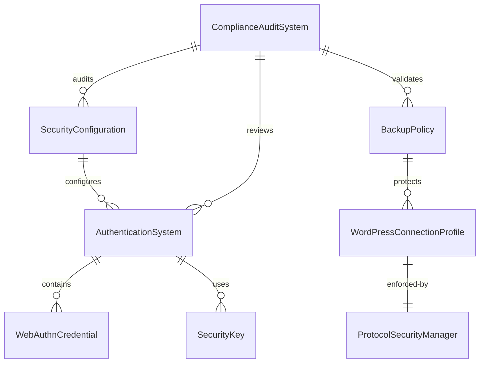

# Data Model: 2025 Best Practices Update

**Phase**: 1 - Design & Contracts
**Feature**: 2025 Best Practices Update
**Generated**: 2025-01-18

## Entity Definitions

Based on the functional requirements from the feature specification, the following entities are required to support 2025 security standards implementation:

### 1. SecurityConfiguration

**Purpose**: Manages platform-wide security settings and compliance configurations

```typescript
interface SecurityConfiguration {
  id: string;
  version: string; // e.g., "2025.1"
  encryptionStandards: {
    cipher: string[]; // ['aes256-gcm', 'aes256-gcm@openssh.com']
    kex: string[];    // ['ecdh-sha2-nistp256', 'ecdh-sha2-nistp384']
    mac: string[];    // ['hmac-sha2-256', 'hmac-sha2-512']
    blockedCiphers: string[]; // ['rc4', '3des', 'aes128-cbc']
  };
  complianceFrameworks: {
    nistCsf: {
      version: string; // "2.0"
      enabled: boolean;
      lastAssessment: Date;
    };
    owaspAsvs: {
      version: string; // "5.0"
      level: number;   // 1, 2, or 3
      lastValidation: Date;
    };
    pciDss: {
      version: string; // "4.1"
      merchantLevel: number;
      complianceExpiry: Date;
    };
    gdpr: {
      enabled: boolean;
      dataProcessingBasis: string[];
      retentionPolicies: Record<string, number>;
    };
  };
  auditSettings: {
    enabled: boolean;
    retentionDays: number;
    alertThresholds: {
      failedAuthentications: number;
      suspiciousActivity: number;
      dataExfiltration: number;
    };
  };
  createdAt: Date;
  updatedAt: Date;
  lastValidated: Date;
}
```

**Validation Rules**:
- `version` must follow semantic versioning
- `encryptionStandards.cipher` must not contain blocked ciphers
- `complianceFrameworks.pciDss.complianceExpiry` must be future date
- `auditSettings.retentionDays` minimum 365 days for compliance

**State Transitions**:
- Draft → Active → Archived
- Validation required before activation
- Annual compliance review mandatory

### 2. AuthenticationSystem

**Purpose**: Manages modern authentication methods including WebAuthn and 2FA

```typescript
interface AuthenticationSystem {
  id: string;
  userId: string;
  primaryMethod: 'password' | 'webauthn' | 'certificate';
  enabledMethods: AuthenticationMethod[];
  webauthnCredentials: WebAuthnCredential[];
  mfaSettings: {
    enabled: boolean;
    methods: ('totp' | 'sms' | 'email' | 'webauthn')[];
    backupCodes: string[];
    lastBackupGenerated: Date;
  };
  securityKeys: SecurityKey[];
  biometricSettings: {
    enabled: boolean;
    supportedTypes: ('fingerprint' | 'faceId' | 'windowsHello')[];
    lastUsed: Date;
  };
  accountRecovery: {
    verifiedEmail: string;
    verifiedPhone?: string;
    recoveryQuestions?: SecurityQuestion[];
    trustedDevices: TrustedDevice[];
  };
  securityEvents: SecurityEvent[];
  createdAt: Date;
  updatedAt: Date;
  lastAuthentication: Date;
}

interface WebAuthnCredential {
  id: string;
  credentialId: string;
  credentialPublicKey: string; // Base64 encoded
  counter: number;
  deviceType: 'platform' | 'cross-platform';
  backedUp: boolean;
  transports: ('usb' | 'nfc' | 'ble' | 'internal')[];
  nickname?: string;
  createdAt: Date;
  lastUsed: Date;
}

interface SecurityKey {
  id: string;
  type: 'yubikey' | 'solokey' | 'generic';
  attestation: string;
  aaguid: string;
  nickname?: string;
  createdAt: Date;
  lastUsed: Date;
}
```

**Validation Rules**:
- At least one authentication method must be enabled
- WebAuthn credentials must have valid public key format
- MFA required for admin accounts
- Backup codes must be cryptographically secure

**Relationships**:
- One-to-One with User
- One-to-Many with WebAuthnCredentials
- One-to-Many with SecurityEvents

### 3. BackupPolicy

**Purpose**: Implements enhanced 3-2-1-1-0 backup standards with GDPR compliance

```typescript
interface BackupPolicy {
  id: string;
  name: string;
  type: 'database' | 'storage' | 'configuration' | 'user-data';
  strategy: {
    primary: StorageLocation;
    backup1: StorageLocation;
    backup2: StorageLocation;
    immutable: ImmutableStorageLocation;
    verification: VerificationSettings;
  };
  schedule: {
    frequency: 'hourly' | 'daily' | 'weekly' | 'monthly';
    time: string; // HH:MM format
    timezone: string;
    retention: {
      daily: number;   // days
      weekly: number;  // weeks
      monthly: number; // months
      yearly: number;  // years
    };
  };
  encryption: {
    algorithm: string; // 'AES-256-GCM'
    keyRotationDays: number;
    encryptInTransit: boolean;
    encryptAtRest: boolean;
  };
  compression: {
    enabled: boolean;
    algorithm: string; // 'gzip', 'brotli'
    level: number; // 1-9
  };
  deduplication: {
    enabled: boolean;
    hashAlgorithm: string; // 'sha256'
    blockSize: number;
  };
  gdprCompliance: {
    dataClassification: DataClassification;
    retentionPeriod: number; // days
    autoDelete: boolean;
    rightsManagement: {
      portability: boolean;
      rectification: boolean;
      erasure: boolean;
    };
  };
  monitoring: {
    successAlerts: boolean;
    failureAlerts: boolean;
    integrityChecks: boolean;
    performanceMetrics: boolean;
  };
  createdAt: Date;
  updatedAt: Date;
  lastExecuted: Date;
  lastVerified: Date;
}

interface StorageLocation {
  provider: 'supabase' | 'aws-s3' | 'azure-blob' | 'gcp-storage';
  region: string;
  bucket: string;
  path: string;
  credentials: {
    type: 'service-account' | 'access-key' | 'managed-identity';
    keyId: string;
    encrypted: boolean;
  };
}

interface ImmutableStorageLocation extends StorageLocation {
  lockMode: 'governance' | 'compliance';
  retentionPeriod: number; // days
  legalHold: boolean;
}
```

**Validation Rules**:
- All three backup locations must be in different regions
- Immutable storage retention minimum 60 days
- Encryption required for all backup types
- GDPR retention period must not exceed classification limits

### 4. WordPressConnectionProfile

**Purpose**: Manages WordPress 6.8+ connectivity with enhanced security standards

```typescript
interface WordPressConnectionProfile {
  id: string;
  websiteId: string;
  name: string;
  url: string;
  version: {
    detected: string;
    supported: boolean;
    eolWarning: boolean;
    securityWarnings: string[];
  };
  authentication: {
    method: 'application-password' | 'sftp' | 'ftps';
    credentials: {
      username: string;
      applicationPassword?: string; // For WordPress auth
      sftpKey?: string;            // For SFTP auth
      passphrase?: string;         // For encrypted keys
    };
    twoFactorEnabled: boolean;
    httpsRequired: boolean;
    lastAuthenticated: Date;
  };
  connection: {
    protocol: 'https' | 'sftp' | 'ftps';
    host: string;
    port: number;
    timeout: number;
    maxRetries: number;
    keepAlive: boolean;
  };
  security: {
    sslVerification: boolean;
    allowSelfSigned: boolean;
    cipherSuites: string[];
    minTlsVersion: string; // '1.2' or '1.3'
    hostKeyFingerprint?: string;
  };
  fileAccess: {
    allowedPaths: string[];
    blockedPaths: string[];
    permissions: {
      read: boolean;
      write: boolean;
      execute: boolean;
      delete: boolean;
    };
    backupBeforeEdit: boolean;
  };
  multisiteConfig?: {
    isMultisite: boolean;
    networkType: 'subdomain' | 'subdirectory';
    sites: WordPressSite[];
    superAdminRequired: boolean;
  };
  monitoring: {
    healthChecks: boolean;
    performanceMetrics: boolean;
    securityScans: boolean;
    lastHealthCheck: Date;
  };
  createdAt: Date;
  updatedAt: Date;
  lastConnected: Date;
  lastSecurityScan: Date;
}

interface WordPressSite {
  id: number;
  name: string;
  domain: string;
  path: string;
  active: boolean;
  lastUpdated: Date;
}
```

**Validation Rules**:
- WordPress version 6.8+ required for full support
- HTTPS required for Application Password authentication
- SFTP/FTPS required for file operations
- Backup required before any file modifications

### 5. ProtocolSecurityManager

**Purpose**: Enforces SFTP/FTPS-only connections and blocks deprecated protocols

```typescript
interface ProtocolSecurityManager {
  id: string;
  connectionId: string;
  protocol: 'sftp' | 'ftps';
  securityLevel: 'strict' | 'compatible' | 'legacy';
  enforcements: {
    blockFtp: boolean;
    requireEncryption: boolean;
    validateCertificates: boolean;
    blockWeakCiphers: boolean;
  };
  cipherConfiguration: {
    allowedCiphers: string[];
    blockedCiphers: string[];
    keyExchangeAlgorithms: string[];
    macAlgorithms: string[];
    compressionAlgorithms: string[];
  };
  certificateValidation: {
    requireValidCertificate: boolean;
    allowSelfSigned: boolean;
    certificateChainValidation: boolean;
    ocspValidation: boolean;
    crlValidation: boolean;
  };
  connectionLimits: {
    maxConcurrentConnections: number;
    connectionTimeoutSeconds: number;
    idleTimeoutSeconds: number;
    maxRetryAttempts: number;
  };
  auditLogging: {
    logAllConnections: boolean;
    logFailedAttempts: boolean;
    logDataTransfers: boolean;
    retentionDays: number;
  };
  complianceValidation: {
    pciDssCompliant: boolean;
    fipsCompliant: boolean;
    lastValidation: Date;
    validationNotes: string;
  };
  createdAt: Date;
  updatedAt: Date;
  lastEnforced: Date;
}
```

**Validation Rules**:
- FTP protocol must be blocked for all new connections
- Cipher suite must not contain deprecated algorithms
- Certificate validation required for production
- Audit logs minimum retention 1 year

### 6. ComplianceAuditSystem

**Purpose**: Tracks compliance status and generates audit reports

```typescript
interface ComplianceAuditSystem {
  id: string;
  auditType: 'nist-csf' | 'owasp-asvs' | 'pci-dss' | 'gdpr' | 'comprehensive';
  framework: {
    name: string;
    version: string;
    requirements: ComplianceRequirement[];
    lastUpdated: Date;
  };
  assessmentResults: {
    overallScore: number; // 0-100
    compliantRequirements: number;
    nonCompliantRequirements: number;
    partialCompliantRequirements: number;
    notApplicableRequirements: number;
  };
  findings: AuditFinding[];
  remediation: {
    highPriorityActions: RemediationAction[];
    mediumPriorityActions: RemediationAction[];
    lowPriorityActions: RemediationAction[];
    estimatedCompletionDate: Date;
  };
  reporting: {
    executiveSummary: string;
    technicalDetails: string;
    complianceGaps: string[];
    recommendations: string[];
    nextAssessmentDate: Date;
  };
  automation: {
    scheduledScans: boolean;
    realTimeMonitoring: boolean;
    alertThresholds: {
      complianceScore: number;
      criticalFindings: number;
      highFindings: number;
    };
  };
  createdAt: Date;
  updatedAt: Date;
  completedAt: Date;
  validUntil: Date;
}

interface ComplianceRequirement {
  id: string;
  category: string;
  requirement: string;
  description: string;
  mandatory: boolean;
  testable: boolean;
  automatable: boolean;
  evidence: string[];
  status: 'compliant' | 'non-compliant' | 'partial' | 'not-applicable';
  lastTested: Date;
}

interface AuditFinding {
  id: string;
  severity: 'critical' | 'high' | 'medium' | 'low' | 'informational';
  category: string;
  title: string;
  description: string;
  evidence: string;
  impact: string;
  recommendation: string;
  status: 'open' | 'in-progress' | 'resolved' | 'accepted-risk';
  assignee?: string;
  dueDate?: Date;
  createdAt: Date;
  updatedAt: Date;
}
```

**Validation Rules**:
- Critical findings must have assigned remediation actions
- Compliance score minimum 85% for production deployment
- Executive summary required for all comprehensive audits
- Evidence required for all compliant requirements

## Entity Relationships



## Data Migration Requirements

### From Existing Schema
1. **Website Records**: Migrate to WordPressConnectionProfile with security defaults
2. **User Authentication**: Enhance with AuthenticationSystem for WebAuthn support
3. **Backup Configuration**: Create BackupPolicy entities from existing backup settings

### New Schema Requirements
1. **webauthn** schema namespace for authentication data
2. **security_audit** schema for compliance tracking
3. **backup_policies** table for enhanced backup configuration
4. **protocol_security** table for connection security enforcement

## Performance Considerations

### Indexing Strategy
```sql
-- Primary indexes for performance
CREATE INDEX idx_auth_system_user_id ON authentication_systems(user_id);
CREATE INDEX idx_webauthn_credential_id ON webauthn_credentials(credential_id);
CREATE INDEX idx_backup_policy_type ON backup_policies(type);
CREATE INDEX idx_wordpress_profile_website_id ON wordpress_connection_profiles(website_id);
CREATE INDEX idx_compliance_audit_type_status ON compliance_audit_systems(audit_type, status);

-- Composite indexes for common queries
CREATE INDEX idx_auth_events_user_date ON security_events(user_id, created_at DESC);
CREATE INDEX idx_backup_schedule_type ON backup_policies(type, schedule_frequency);
CREATE INDEX idx_compliance_findings_severity ON audit_findings(severity, status);
```

### Caching Strategy
- SecurityConfiguration: Cache for 1 hour (rarely changes)
- AuthenticationSystem: Cache for 15 minutes (frequent updates)
- BackupPolicy: Cache for 30 minutes (moderate updates)
- ComplianceAuditSystem: No caching (real-time data required)

This data model provides the foundation for implementing comprehensive 2025 security standards while maintaining performance and compliance requirements.